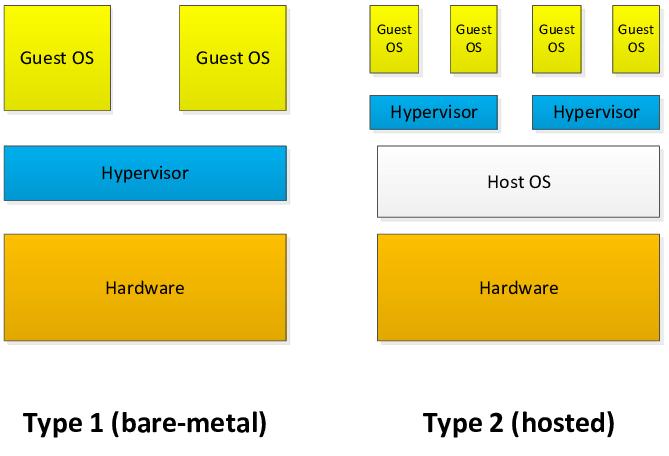
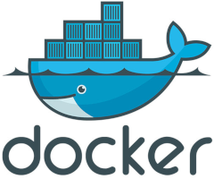
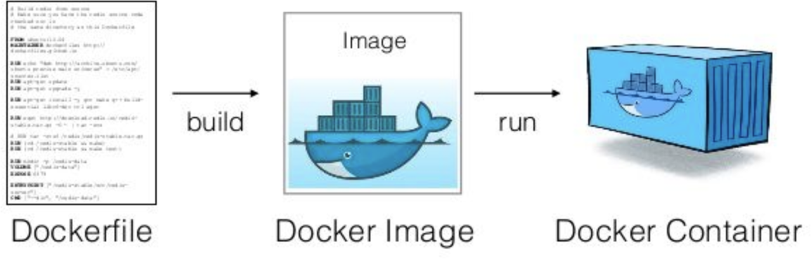

# Introducció a Docker

---

## Antecedents I

Serveis instal·lats a màquines físiques. Problema? Dependència amb el hardware.

Sol·lució? **Hypervisor** (o Virtual Machine Monitor / VMM). Software que permet a un sistema operatiu emular hardware. Sobre aquest emulador de hardware instal·les el teu sistema operatiu i tens el que s’anomena una **màquina virtual**, i a aquests instal·les el programari que vols.

Avantatges? No depens del hardware, tens la màquina aïllada, etc.

---

## Antecedents II



---

## Antecedents III

Si el que vull és, per exemple, fer córrer una base de dades, o tenir un wordpress, és necessari començar des de tan avall? 

És necessari tenir un emulador de hardware, instal·lar un sistema operatiu complet, afegir les llibreries necessàries i, acabar instal·lant el programari (wordpress, per exemple) si el que necessito és un **procés aïllat amb les seves dependències consistents**?

I aquí és on entren els **contenidors**.

---

## Contenidor

Un **contenidor** és un procés virtualitzat aïllat.

Linux i windows permeten de forma nativa al seu kernel executar contenidors gràcies a fet que proporcionen els tres serveis bàsics següents:

* **namespaces**: processos, sistema de fitxers i usuaris aïllats.
* **cgroups**: assigna, limita i aïlla l'ús de recursos (CPU, memòria, E/S, ...) els processos.
* **overlayfs**: sistema de fitxers basat en capes que permet el mode “copy on write”. Concepte clau per entendre com funcionen les imatges i els contenidors de docker.

---

## Docker

Docker és un programari lliure i de codi obert que permet crear, desplegar i executar contenidors. És l’eina més popular de l'ecosistema dels contenidors.

Per a linux hi ha Docker Engine, que és la que faré servir a aquesta introducció: https://docs.docker.com/engine/

Per a windows/Mac existeix l’opció de Docker Desktop: https://docs.docker.com/desktop/



---

## Dockerfile, imatge i contenidor

Un **dockerfile** és un fitxer de text que inclou les instruccions necessàries per a crear una imatge.

Una **imatge** és el punt de partida a partir de la qual s’iniciaran els contenidors.

Un **contenidor** és la instància concreta d’una imatge.



---

## Instal·lació de docker-engine

Consultar la documentació oficial: https://docs.docker.com/get-docker/

Docker Engine funciona com un daemon a qui enviem les comandes en forma de missatges fent servir la instrucció docker.

Executant simplement docker podeu veure totes les comandes disponibles.

Executant la comanda següent comprovem que docker s'ha instal·lat correctament:

    docker run hello-world

Podem consultar la versió que tenim executant `docker version`.

---

## Dockerfile

Un **Dockerfile** és un fitxer de text que inclou les instruccions necessàries per a crear una **imatge**.

Cadascuna de les instruccions construeix una capa de la imatge (overlayfs!)

La primera instrucció és **FROM**, on s’indica a partir de quina imatge es parteix.

Hi ha un repositori públic d’imatges, [docker hub](https://hub.docker.com/search?q=&type=image), d’on es descarreguen per defecte les imatges.

---

## Sintaxi Dockerfile

Sintaxi d’un Dockerfile:

* FROM: imatge base de partida
* RUN: executa una comanda a la shell
* ENV: defineix una variable d’entorn
* COPY: afegeix un fitxer o directori a la imatge
* ENTRYPOINT: ordre que s’executa a l'iniciar-se el contenidor. Normalment, és el procés pel qual creem el contenidor
* CMD: paràmetres per defecte per l’entrypoint
* … i molts altres que es poden consultar a la [documentació de docker](https://docs.docker.com/engine/reference/builder/).

---

## Exemple 1: flask

```dockerfile
FROM ubuntu:20.04
ENV TZ Europe/Madrid
RUN apt-get update
RUN apt-get install -y tzdata
RUN ln -snf /usr/share/zoneinfo/$TZ /etc/localtime && dpkg-reconfigure -f noninteractive tzdata
RUN apt-get install -y python3
RUN apt-get install -y python3-pip
RUN pip3 install flask
WORKDIR /myapp
RUN mkdir static
COPY app.py .
ENTRYPOINT [ "python3" ]
CMD [ "app.py" ]
```

---

## Comandes per l’exemple 1 (I)

    docker build . -t flaskdemo
    docker images
    docker images -a
    docker rmi
    docker run flaskdemo
    docker ps
    docker ps -a
    docker run -p 80:80 flaskdemo
    docker rm

---

## Comandes per l’exemple 1 (II)

    docker run -d -p 80:80 flaskdemo
    docker logs -f <container id>
    docker stop <container id>
    docker start <container id>
    docker run -rm -p -d 80:80 flaskdemo
    docker run -v images:/myapp/static -p 80:80 flaskdemo3
    docker volume ls
    docker volume inspect images
    docker run -v /home/adasilva/static:/myapp/static -p 80:80 flaskdemo3

---

## Observacions de l’exemple 1

* Xarxa: docker crea una xarxa virtual 172.17.0.0/16 (com a mínim a Linux)
Els containers quan s’aturen no s’esborren (si no ho indiquem) i mantenen l’estat.
* Per tenir dades “permanents” s’han de fer servir volums.
* Per a publicar serveis a l’exterior s’ha de fer mapeig de ports
* Recomanacions
  * Unificar instruccions del tipus RUN
  * Fer neteja de recursos (menys és més!)
  * Fer servir imatges base més adaptades a les nostres necessitats

---

## Exemple 2: Workdpress

És una bona pràctica identificar contenidor com “un procés virtualitzat aïllat”.

Hi ha situacions on volem diversos “processos” que treballin plegats per a donar un servei. Per exemple, per tenir un wordpress operatiu, necessitem:

* [Una instància de wordpress corrent en un servidor web](https://hub.docker.com/_/wordpress)
* [Una instància de base de dades (MySQL)](https://hub.docker.com/_/mysql)

Podríem fer una única imatge amb tots dos processos, però no és recomanable.

---

## Docker Compose

Per executar diversos contenidors que han de treballar de manera colaborativa tenim l’eïna **Docker Compose**: https://docs.docker.com/compose/

Docker compose s’ha d’instal·lar expressament: https://docs.docker.com/compose/install/

Per fer-ho servir, s’ha de crear un fitxer de configuració en format YAML on es defineix la xarxa o xarxes, els contenidors que s’han d’iniciar amb els seus paràmetres i la dependència que hi ha entre ells.

---

## docker-compose.yml de wordpress (I)

```yaml
version: '3.1'

services:

  wordpress:
    depends_on:
      - db
    image: wordpress:5
    restart: always
    ports:
      - 80:80
    environment:
      WORDPRESS_DB_HOST: db
      WORDPRESS_DB_USER: joe
      WORDPRESS_DB_PASSWORD: joe123
      WORDPRESS_DB_NAME: wordpress
    volumes:
      - wordpress2:/var/www/html

```

---

## docker-compose.yml de wordpress (II)


```yaml
  db:
    image: mysql:5.7
    restart: always
    environment:
      MYSQL_DATABASE: wordpress
      MYSQL_USER: joe
      MYSQL_PASSWORD: joe123
      MYSQL_ROOT_PASSWORD: root123
    volumes:
      - mysql2:/var/lib/mysql

volumes:
  wordpress2:
  mysql2:
```

---

## Comandes amb el docker-compose

Dins del directori on hi ha el fitxer yml:

    docker-compose up

També es pot fer com a daemon:

    docker-compose up -d
    docker-compose down

Es crea una xarxa per defecte que comparteixen els dos contenidors:

    docker network ls

---

## Exemple 3: MySQL

En aquest exemple farem servir docker-compose encara que es tract d'un únic contenidor fent servir una imatge de [mysql](https://hub.docker.com/_/mysql).

En aquest cas és útil per no haver de escriure els paràmetres necessaris de la nostra instància postgres per línia de comandes ni per fer servir un script. Tan sols executant `docker-compose up` al la carpeta on hi és el fitxer `docker-compose.yml` ja tenim la base de dades iniciada.

Per connectar-me, si tinc el client mysql instal·lat en la màquina real:

    mysql -h 127.0.0.1 -u joe -p joedb

---

## docker-compose.yml de mysql

```yaml
version: '3.1'

services:
  mysql:
    image: mysql:5.7
    environment:
      MYSQL_DATABASE: joedb
      MYSQL_USER: joe
      MYSQL_PASSWORD: joe123
      MYSQL_ROOT_PASSWORD: root123
    volumes:
      - ./data/mysql:/var/lib/mysql
    ports:
      - "3306:3306"
```

---

## Prova de connexió a un MySQL dockeritzat

Primer crearé una taula i amb algunes dades:

```sql
create table items(nom varchar(40));
insert into items values ('cadira');
insert into items values ('taula');
insert into items values ('sofà');
select nom from items order by nom;
```

A continuació executo el programa amb python que es connecta a la base de dades i fa una consulta a la taula:

    python3 test_mysql.py

---

## Exemple 4: Postgres

Igual que a l'exemple anterior, farem servir docker-compose amb un únic contenidor fent servir una imatge de [postgres](https://hub.docker.com/_/postgres).

En aquest cas, el contenidor de Postgres s'iniciarà creant una base de dades que hem especificat en el cas que no existeixi. Per aconseguir-ho, en lloc de fer servir la imatge oficial de Postgres directament al docker-compose.yml, indiquem que construeixi una imatge que tenim definida al directori build.

```dockerfile
FROM postgres:12.7
COPY init.sql /docker-entrypoint-initdb.d/
```

---

## docker-compose.yml de postgres

```yaml
version: '3.1'

services:
  postgres:
    build: ./build
    environment:
      TZ: "Europe/Madrid"
      POSTGRES_PASSWORD: patata123
      PGDATA: /var/lib/postgresql/data/pgdata
    volumes:
      - ./data:/var/lib/postgresql/data
    ports:
      - "5432:5432"
```

---

## Més comandes amb el docker-compose

Amb `docker-compose up`, es construeixen les imatges indicades als paràmetres `build` i s'inicien. En el cas de que la imatge canvi, no es construeixen de nou. Per forçar-ho `docker-compose up --build`

A més dels paràmetre `up/down`, existeix la dupla `start/stop`. Amb `up`, construeixes (la 1a vegada) creas i inicies els contendidors, i amb `down`atures i esborres els contenidors. Amb `start/stop` inicies i atures contenidors que s'han aturat (per exemple, per fer CTRL+C amb up, o s'ha atutat la màquina anfitriona o el servei docker)

https://docs.docker.com/compose/reference/

---

## Com connectar-se a un postgres dockeritzat

Amb un client psql des de la màquina real:

    psql -U postgres -h 127.0.0.1 

També podem fer instanciar un contenidor de postgres per executar `psql` i que s'esborri quan acabem:

    docker run -it --rm --network exemple_4_postgres_default postgres:12.7 \ 
      psql -h exemple_4_postgres_postgres_1 -U postgres

O podem fer servir l'opció d'executar una comanda a un contenidor que està corrent:

    docker exec -it exemple_4_postgres_postgres_1 bash

O directament:

    docker exec -it -u postgres exemple_4_postgres_postgres_1 psql

---

## Casos d’us de docker/docker-compose

Hi ha situacions on docker pot ser una eïna útil com a alternativa a VirtualBox.

* Bases de dades: MySQL, PostgreSQL ...
* Gestors de continguts: wordpress, wiki, moodle ... 
* Desplegament d’aplicacions web: apache, nginx …

I d’altres…

* Entorns per a compilar C, C++, Node sense haver d’instal·lar res a la màquina física (compilar Chromium, per exemple)
* Execució de programes amb interfície gràfica que requereixen un s.o. concret o instal·lar moltes dependències: https://www.cloudsavvyit.com/10520/how-to-run-gui-applications-in-a-docker-container/

---

## I desprès? Docker swarm

L'evolució natural de `docker-compose` és tenir una funcionalitat similar però distribuida en diferents nodes.

L'opció més fàcil és continuar en l'ecosistema docker i fer servir `docker-swarm`: https://docs.docker.com/engine/swarm/swarm-tutorial/. Amb *swarm*, hi ha un node lider que inicia el *cluster* i els altres nodes s'apunten a aquest cluster.

Amb un [fitxer en format YAML](https://github.com/iiriix/docker-swarm-wordpress) molt similar al de `docker-compose`, es poden definir els diferents contenidors (aka *serveis*) que composen l'*stack* a desplegar i quantes instàncies de cadascun cal.

---

## Repositori amb els exemples i la presentació

https://github.com/alfonsovng/IntroduccioDocker

## Presentació feta amb Marp

https://marp.app/

## Gràcies per la vostra atenció ;)
